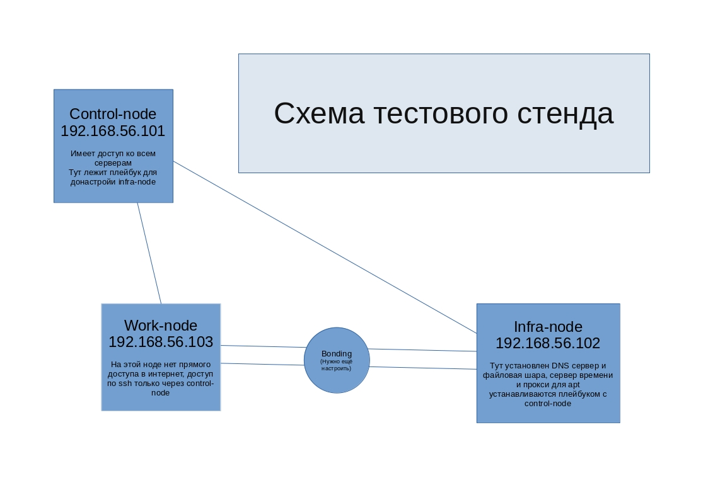

# Лаба

### Для выполнения лабы вам потребуется vagrant и virtualbox

##### Подготовка тестового стенда

1. ```export VAGRANT_EXPERIMENTAL="disks"``` подключаем к vagrant функцию создания дисков
2. ```vagrant up``` создаст виртуалки и настроит их в соответствии со схемой:
3. Заходим на control-node по ssh ```vagrant ssh control-node```
4. Заходим на infra-node с control-node ```ssh vagrant@192.168.56.102``` пароль ```vagrant```, ssh спросит добавить ли хост в know_hosts, вводим ```yes```
5. Отключаемся от infra-node ```exit``` или Ctrl+d
6. Переходим в директорию с плейбуком ```cd ansible```
7. Запускаем плейбук ```./default.yml -Kkb``` пароль ```vagrant```
8. Тестовый стенд готов, можно подключаться к work-node ```ssh vagrant@192.168.56.103``` и приступать к выполнению лабы.
9. **Если вы всё сломали и хочется вернуть всё в зад**, можно с помощью ```vagrant destroy -f``` удалить все виртуалки и вернуться к пункту **1**

### Что нужно сделать в рамках лабы

1. Настроить bonding между work-node и infra-node
2. Настроить на work-node DNS-запросы на infra-node, сервера должны начать пинговаться по именам (infra-node, control-node) а не только по IP
3. Настроить менеджер пакетов apt на работу через прокси infra-node:3142
4. Примонтировать файловую шару infra-node:/nfsshare к work-node, создать там пару файлов
5. Настроить на work-node синхронизацию времени через infra-node
6. На work-node есть два не примонтированных диска, нужно объединить их с помощью LVM, примонтировать и перенести туда системные логи
